## Chrome拡張機能のイメージ

<div align="center">
  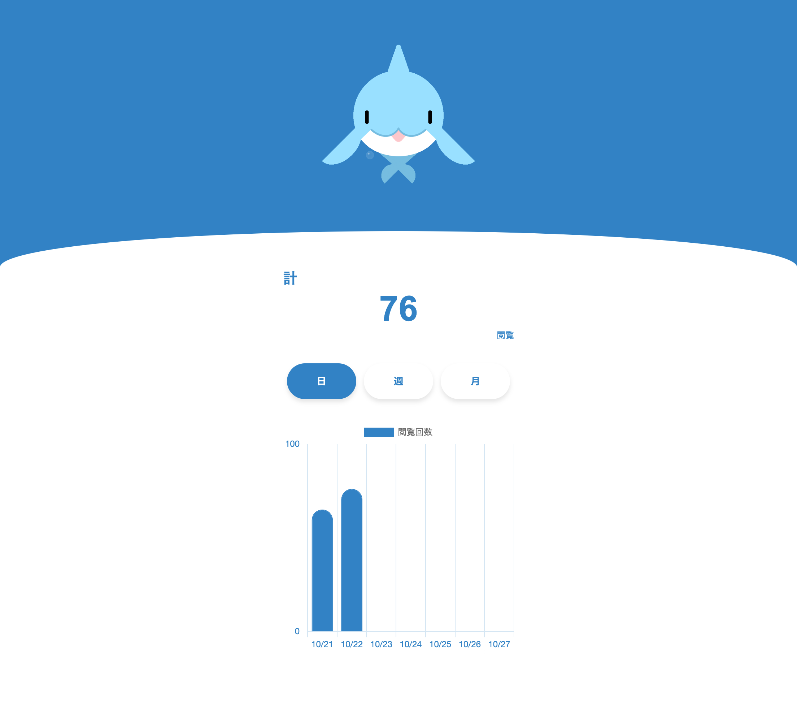
</div>

## プロジェクトについて

Webページの閲覧回数を記録するChrome拡張機能を開発しています。<br/>
本プロジェクトにはテストデータを投入したデモ版と<br/>
開発途中のChrome拡張機能が含まれています。<br/>
Chrome拡張機能はGoogle Chromeのみ動作します。

## デモのURL

<p align="left">
	<a href="https://yukikomori332.github.io/Web-Miruka-Demo/">デモ版へ</a>
</p>

## 拡張機能の導入方法（Google Chrome）

| 手順1 | 手順2 |
| :--- | :--- | 
| Google Chromeを起動し、右上の3点リーダー（︙）をクリックします。 | 拡張機能 > 拡張機能を管理 を選択します。|
| 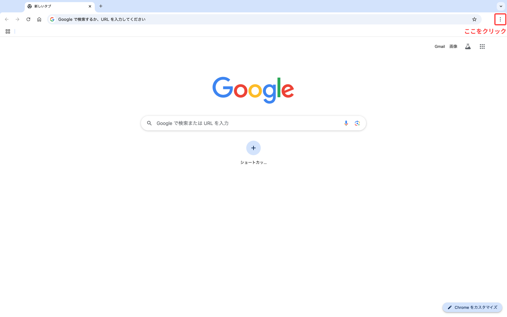 | 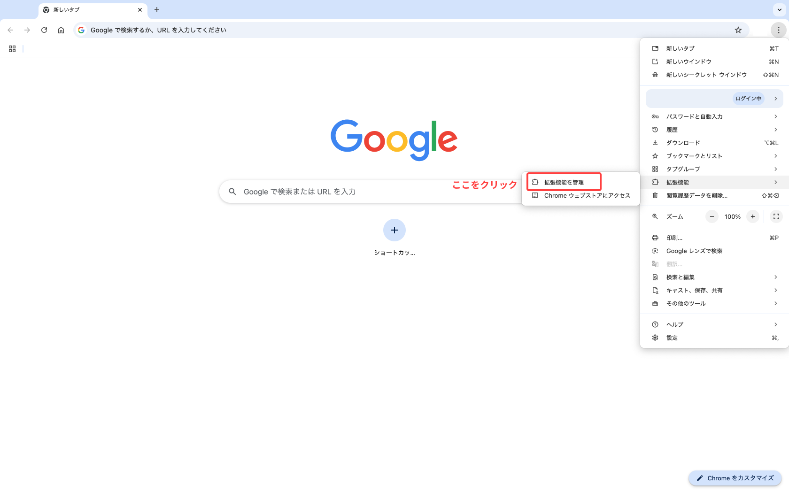 |

| 手順3 | 手順4 |
| :--- | :--- | 
| 拡張機能の画面を開いたら、右上の「デベロッパーモード」のトグルをオンにします。 | トグルをオンにすると、左に「パッケージ化されていない機能拡張を読み込む」というメニューが出てくるので、これをクリックします。<br/>ファイル選択画面が開くので、このプロジェクトの中にある「chrome-extension」のフォルダを選択します。|
| 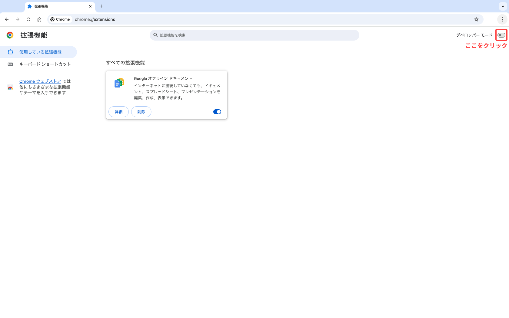 | 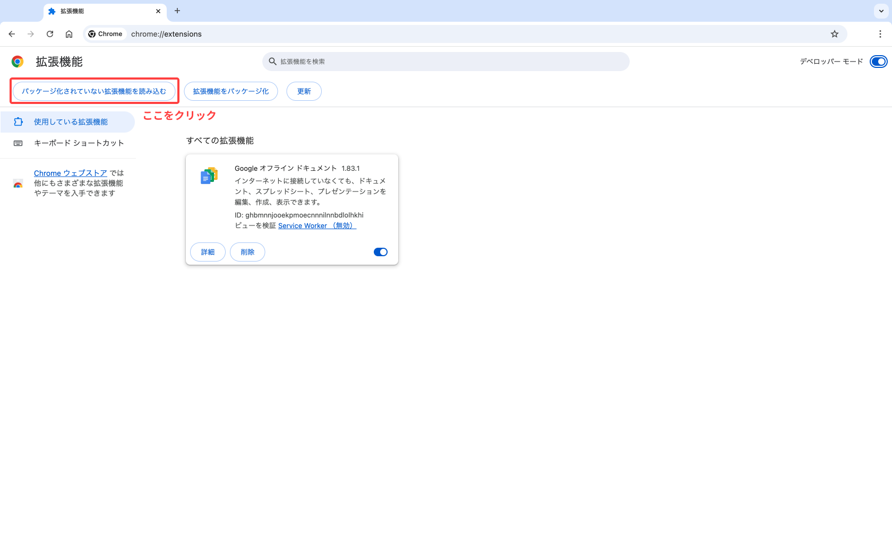 |

| 手順5 | 手順6 |
| :--- | :--- | 
| 拡張機能が読み込まれたら、「詳細」をクリックします。 | 「拡張機能のオプション」をクリックします。|
| 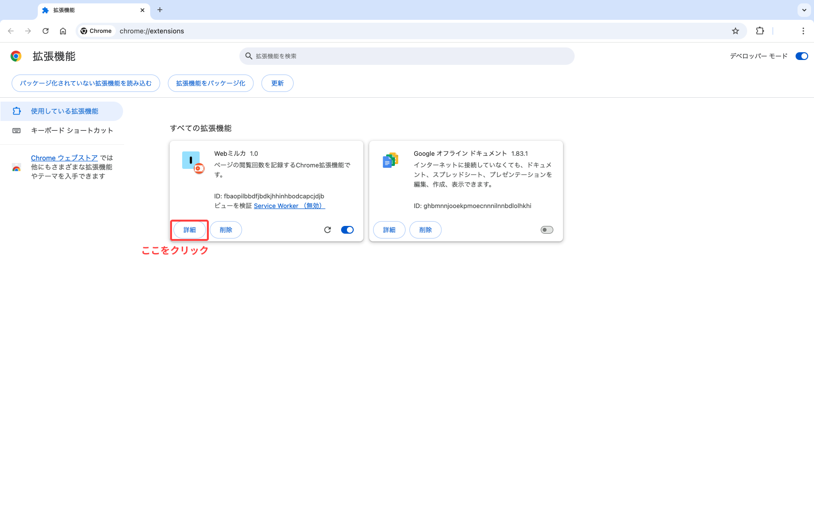 | 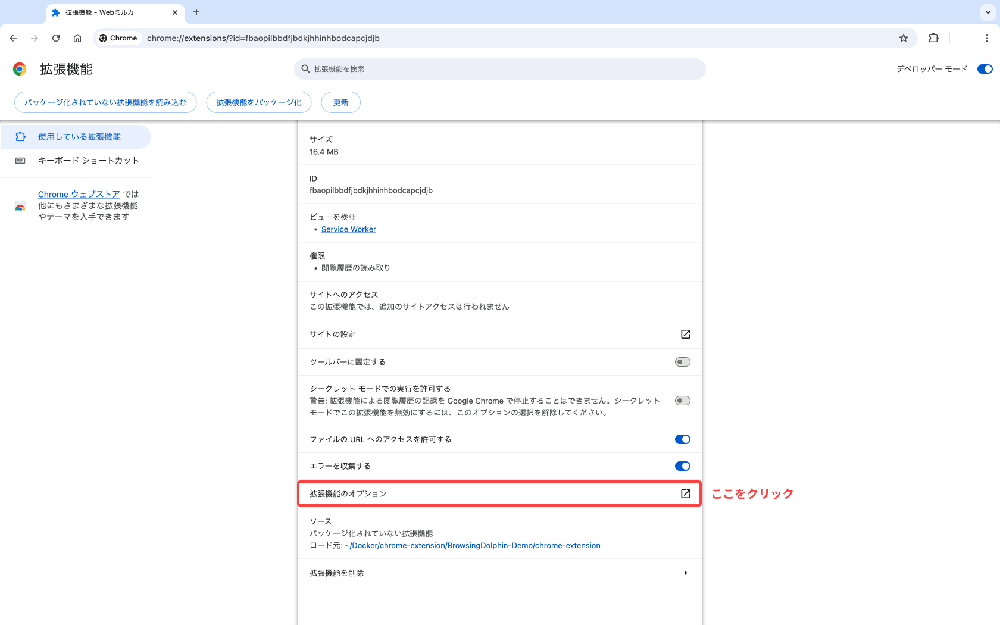 |

| 手順7 |
| :--- |
| ページが開いたら、導入完了です。お疲れさまでした！ <br/>（デベロッパーモードのトグルをオフに戻してもらって大丈夫です。）| 
| 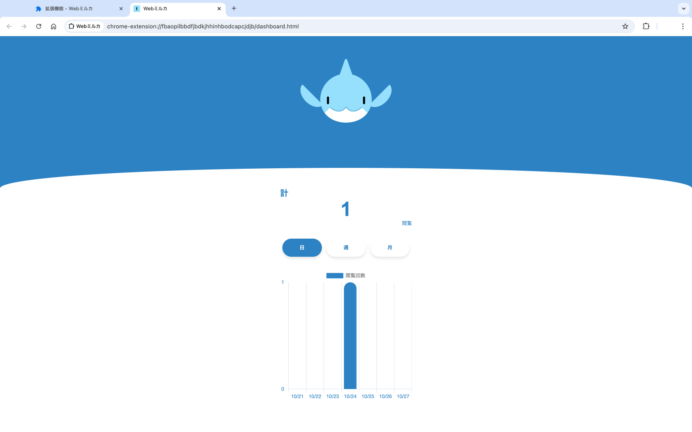 |

## 拡張機能について

Google Chromeでページを閲覧した回数を記録します。<br/>
記録した回数は日別・週別・月別で集計されます。<br/>
Google Chromeで新しいタブを開いたり、ページを読み込んだときに閲覧回数を1カウントします。

| 日 | 週 | 月 |
| :---: | :---: | :---: |
|  | 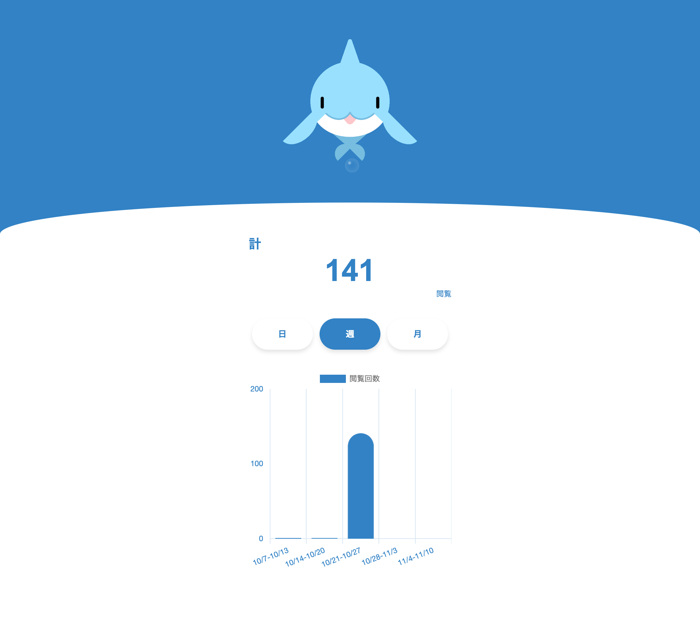 | 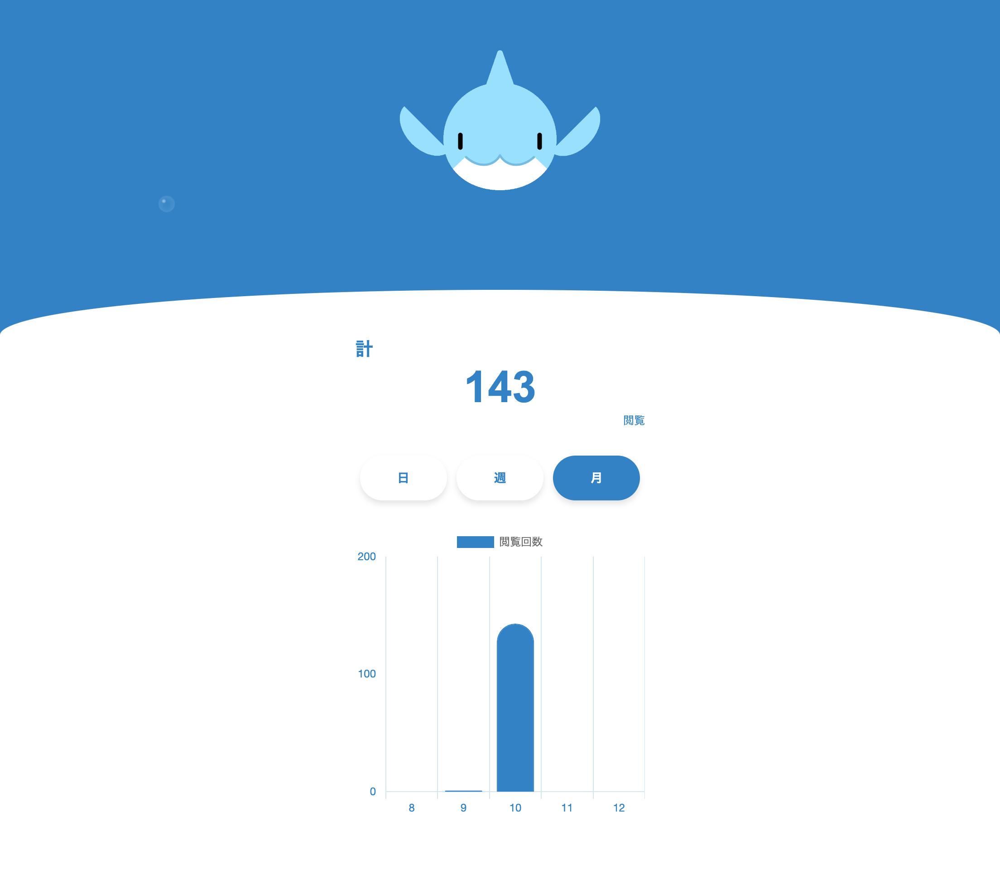 |

<h3>スマートフォンの場合</h3>

| 日 | 週 | 月 |
| :---: | :---: | :---: |
| 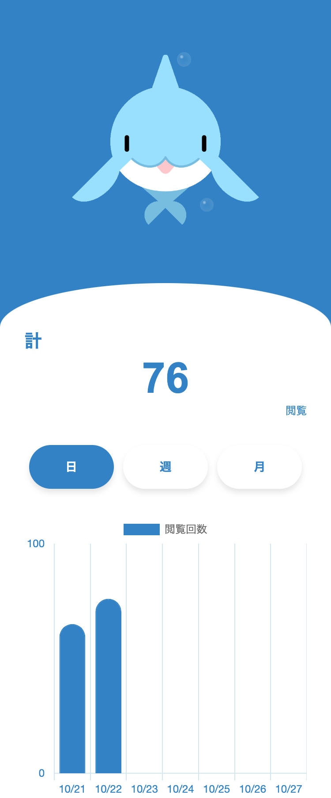 | 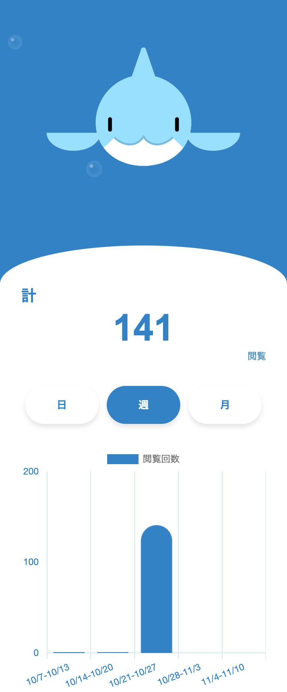 | 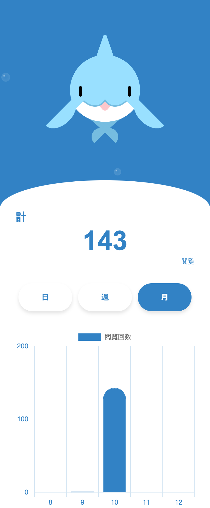 |

## 使用技術一覧
<div style="display: inline">
  <!-- インフラ一覧 -->
  
</div>
<div style="display: inline">
  <!-- フロントエンド一覧 -->
  
  
</div>

## バージョン

<!-- 言語、フレームワーク、インフラの一覧とバージョンを記載 -->

| 言語・フレームワーク | バージョン |
| :--- | :--- |
| Docker | 27.1.1 |
| Node.js | 20.18.0 |
| Chart.js | 4.4.5 |

## 開発環境構築

<!-- コンテナの作成方法、パッケージのインストール方法など、開発環境構築に必要な情報を記載 -->

### 必要なパッケージのインストール

必要なパッケージが存在しなければ、<br/>
chrome-extensionディレクトリにて、以下のコマンドを実行してください。

```
docker-compose build

docker-compose run --rm app npm install <パッケージ名>
```

## システム構成図
未定

## ER図
未定

## 開発のきっかけ

スマホの歩数計アプリから着想を得ました。<br/>
歩数ではなく、Webページの閲覧回数を記録したら面白いだろうかと考えたのがきっかけでした。<br/>

## 今後の展望

このChrome拡張機能の記録データは、Google Chromeのローカルストレージに保存しています。<br/>
現在、記録データの定期的な削除を行なっておらず、ローカルストレージを圧迫する仕様となっています。<br/>
この課題を解決するために、データベースの設計とユーザーの認証機能を優先して追加したいと考えています。<br/>

### 今後の予定
- ユーザーの認証機能を追加する
- データベースを使ったユーザー情報の管理機能を追加する
- ログイン、サインアップ、メールアドレス変更、パスワード変更、プロフィール画面を追加する
- テーマカラーを変更する機能を追加する
